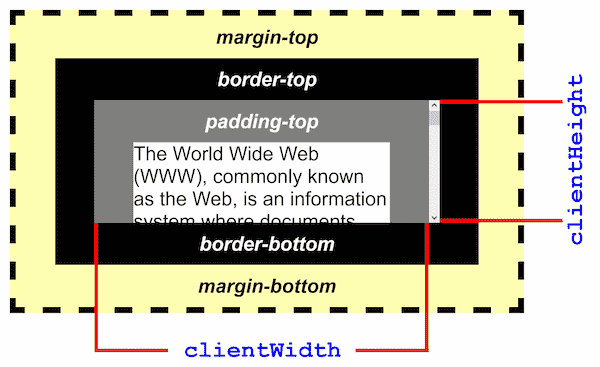

# Layout

## Element

### [clientHeight](https://developer.mozilla.org/zh-CN/docs/Web/API/Element/clientHeight)

只读属性 `Element.clientHeight` 对于没有定义 CSS 或者内联布局盒子的元素为 0；否则，它是元素内部的高度（以像素为单位），包含内边距，但不包括边框、外边距和水平滚动条（如果存在）。

`clientHeight` 可以通过 CSS `height` + CSS `padding` - 水平滚动条高度（如果存在）来计算。

在根元素（`<html>` 元素）或怪异模式下的 `<body>` 元素上使用 clientHeight 时，该属性将返回视口高度（不包含任何滚动条）。

<!--  -->

### [scrollHeight](https://developer.mozilla.org/zh-CN/docs/Web/API/Element/scrollHeight)

`Element.scrollHeight` 只读属性是一个元素内容高度的度量，包括由于溢出导致的视图中不可见内容。

<!--  -->

`scrollHeight` 的值等于该元素在不使用滚动条的情况下为了适应视口中所用内容所需的最小高度。高度的度量方式与 `clientHeight` 相同：包括元素的内边距，但不包括元素的边框、外边距以及水平滚动条（如果存在）。它也包括 `::before` 和 `::after` 这样的伪元素的高度。如果元素的内容不需要垂直滚动条就可以容纳，则其 `scrollHeight` 等于 `clientHeight`。

## HTMLElement